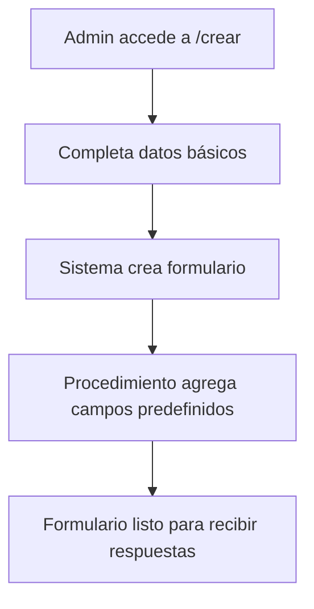
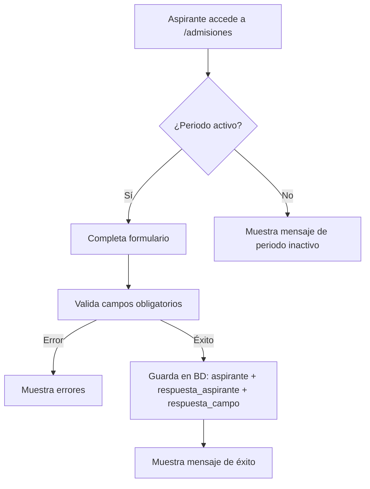
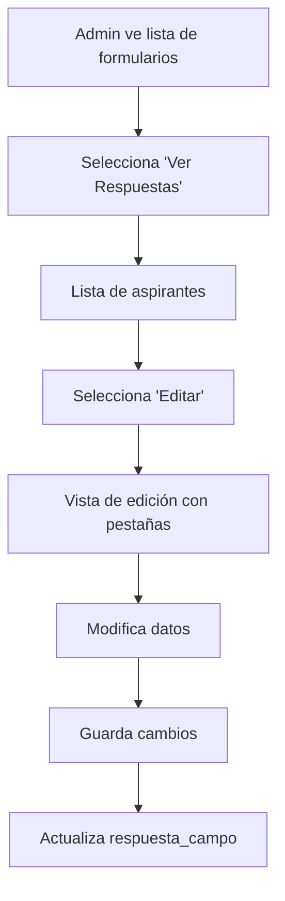

# 📋 Módulo de Formularios de Admisión - Documentación Completa

## 🎯 Descripción General

El **Módulo de Formularios de Admisión** es un sistema completo para la gestión de procesos de admisión académica, que permite crear formularios dinámicos, recibir respuestas de aspirantes y gestionar todo el ciclo de vida de las admisiones.

---

## 🏗️ Arquitectura del Sistema

### **Patrón MVC (Model-View-Controller)**
- **Model**: Entidades y Managers para lógica de negocio
- **View**: Templates `.phtml` para presentación
- **Controller**: `FormularioAdmisionController` para coordinación

### **Componentes Principales**
1. **Gestión de Formularios** (CRUD completo)
2. **Sistema de Campos Dinámicos** (tipos variados)
3. **Recepción de Respuestas Públicas** (aspirantes)
4. **Administración de Respuestas** (staff administrativo)

---

## 📁 Estructura de Archivos

```
📦 Módulo Formulario de Admisión
├── 🗄️ Base de Datos
│   ├── formularios_admision_tablas.sql
│   └── campos_predefinidos_formulario_admision.sql
├── 🎮 Controladores
│   └── FormularioAdmisionController.php
├── 🧠 Servicios/Managers
│   └── FormularioAdmisionManager.php
├── 🏛️ Entidades
│   ├── FormularioAdmision.php
│   ├── CampoFormulario.php
│   ├── Aspirante.php
│   └── RespuestaAspirante.php
├── 🎨 Vistas
│   ├── index.phtml
│   ├── respuestas.phtml
│   ├── editar-respuesta.phtml
│   ├── public.phtml
│   └── crear.phtml
├── 📝 Formularios
│   └── FormularioAdmisionForm.php
└── ⚙️ Configuración
    ├── module.config.php (rutas y vistas)
    └── access_filter.php (permisos)
```

---

## 🗄️ Base de Datos

### **Tablas Principales**

#### **1. formulario_admision**
```sql
CREATE TABLE formulario_admision (
    id_formulario INT AUTO_INCREMENT PRIMARY KEY,
    nombre VARCHAR(100) NOT NULL,
    fecha_creacion DATETIME DEFAULT CURRENT_TIMESTAMP(),
    fecha_inicio_admision DATETIME NOT NULL,
    fecha_fin_admision DATETIME NOT NULL,
    activo TINYINT(1) DEFAULT 1,
    creado_por INT,
    FOREIGN KEY (creado_por) REFERENCES usuario(id_usuario)
);
```
**Propósito**: Almacena la configuración básica de cada formulario de admisión.

#### **2. campo_formulario**
```sql
CREATE TABLE campo_formulario (
    id_campo INT AUTO_INCREMENT PRIMARY KEY,
    id_formulario INT NOT NULL,
    nombre_campo VARCHAR(100) NOT NULL,
    etiqueta VARCHAR(200) NOT NULL,
    tipo_campo ENUM('texto', 'email', 'telefono', 'select', 'textarea', 'fecha', 'archivo', 'boolean', 'time'),
    opciones TEXT,
    requerido BOOLEAN DEFAULT FALSE,
    orden_campo INT DEFAULT 0,
    activo BOOLEAN DEFAULT TRUE,
    FOREIGN KEY (id_formulario) REFERENCES formulario_admision(id_formulario) ON DELETE CASCADE
);
```
**Propósito**: Define los campos dinámicos que conforman cada formulario.

#### **3. aspirante**
```sql
CREATE TABLE aspirante (
    id INT AUTO_INCREMENT PRIMARY KEY,
    cui VARCHAR(20) NOT NULL UNIQUE,
    photo_dpi VARCHAR(255) NOT NULL,
    nombres VARCHAR(100) NOT NULL,
    apellidos VARCHAR(100) NOT NULL,
    correo_electronico VARCHAR(150) NOT NULL,
    telefono VARCHAR(20) NOT NULL
);
```
**Propósito**: Información básica de los aspirantes (extraída de campos predefinidos).

#### **4. respuesta_aspirante**
```sql
CREATE TABLE respuesta_aspirante (
    id_respuesta INT AUTO_INCREMENT PRIMARY KEY,
    id_formulario INT NOT NULL,
    aspirante_id INT NOT NULL,
    fecha_envio TIMESTAMP DEFAULT CURRENT_TIMESTAMP,
    FOREIGN KEY (aspirante_id) REFERENCES aspirante(id),
    FOREIGN KEY (id_formulario) REFERENCES formulario_admision(id_formulario) ON DELETE CASCADE
);
```
**Propósito**: Registro de cada envío de formulario por aspirante.

#### **5. respuesta_campo**
```sql
CREATE TABLE respuesta_campo (
    id_respuesta_campo INT AUTO_INCREMENT PRIMARY KEY,
    id_respuesta INT NOT NULL,
    id_campo INT NOT NULL,
    valor_respuesta TEXT,
    archivo_adjunto VARCHAR(255),
    FOREIGN KEY (id_respuesta) REFERENCES respuesta_aspirante(id_respuesta) ON DELETE CASCADE,
    FOREIGN KEY (id_campo) REFERENCES campo_formulario(id_campo) ON DELETE CASCADE,
    UNIQUE KEY unique_respuesta_campo (id_respuesta, id_campo)
);
```
**Propósito**: Almacena las respuestas específicas para cada campo del formulario.

### **Procedimiento Almacenado**
```sql
DELIMITER $$
CREATE PROCEDURE CrearCamposPredefinidos(IN formulario_id INT)
BEGIN
    -- Inserta campos estándar: CUI, nombres, apellidos, correo, teléfono, foto DPI, etc.
END$$
```
**Propósito**: Crea automáticamente campos predefinidos al crear un nuevo formulario.

---

## 🎮 Controlador Principal

### **FormularioAdmisionController.php**
Ubicación: `/module/Eep/src/Controller/FormularioAdmisionController.php`

#### **Acciones Disponibles**

| Acción | Ruta | Descripción | Permisos |
|--------|------|-------------|----------|
| `indexAction()` | `/formulario-admision` | Lista formularios activos y archivados | Admin/Staff |
| `respuestasAction()` | `/formulario-admision/respuestas/ID` | Lista respuestas de un formulario | Admin/Staff |
| `editarRespuestaAction()` | `/formulario-admision/editar-respuesta/ID` | Edita respuesta específica | Admin/Staff |
| `crearAction()` | `/formulario-admision/crear` | Crea nuevo formulario | Admin |
| `archivarAction()` | `/formulario-admision/archivar/ID` | Archiva formulario | Admin |
| `eliminarAction()` | `/formulario-admision/eliminar/ID` | Elimina formulario | Admin |
| `publicAction()` | `/admisiones` | Formulario público para aspirantes | Público |

---

## 🧠 Manager de Servicios

### **FormularioAdmisionManager.php**
Ubicación: `/module/Eep/src/Service/FormularioAdmisionManager.php`

#### **Métodos Principales**

##### **Gestión de Formularios**
- `getFormulariosActivos()`: Obtiene formularios activos con contador de respuestas
- `getFormulariosArchivados()`: Obtiene formularios archivados
- `crearFormulario($datos)`: Crea nuevo formulario + campos predefinidos
- `archivarFormulario($id)`: Desactiva formulario
- `eliminarFormulario($id)`: Elimina formulario y datos relacionados

##### **Gestión de Respuestas**
- `getRespuestasFormulario($id)`: Lista respuestas de un formulario
- `getRespuestaDetallada($id)`: Obtiene campos de una respuesta específica
- `registrarRespuestaPublica($id, $campos, $data, $files)`: Registra nueva respuesta
- `eliminarRespuesta($id)`: Elimina respuesta completa

##### **Métodos Auxiliares**
- `getCamposFormulario($id)`: Obtiene campos activos de un formulario
- `getFormularioPorRespuesta($id)`: Obtiene formulario por ID de respuesta

---

## 🏛️ Entidades del Sistema

### **FormularioAdmision.php**
```php
class FormularioAdmision {
    private $idFormulario;
    private $nombre;
    private $fechaCreacion;
    private $fechaInicioAdmision;
    private $fechaFinAdmision;
    private $activo;
    private $creadoPor;
    // + getters/setters y métodos de utilidad
}
```

### **CampoFormulario.php**
```php
class CampoFormulario {
    private $idCampo;
    private $nombreCampo;
    private $etiqueta;
    private $tipoCampo;
    private $opciones;
    private $requerido;
    private $ordenCampo;
    // + getters/setters
}
```

### **Aspirante.php** & **RespuestaAspirante.php**
Manejan datos de aspirantes y sus respuestas respectivamente.

---

## 🎨 Sistema de Vistas

### **1. index.phtml** - Panel Principal
**Ruta**: `/module/Eep/view/eep/formulario-admision/index.phtml`

**Características**:
- Lista formularios activos y archivados en pestañas separadas
- Botones de acción: Ver Respuestas, Archivar, Eliminar
- Contador de respuestas por formulario
- Alertas de confirmación para acciones destructivas

### **2. respuestas.phtml** - Lista de Respuestas
**Ruta**: `/module/Eep/view/eep/formulario-admision/respuestas.phtml`

**Características**:
- Tabla con datos básicos de aspirantes
- Checkboxes para selección múltiple
- Funciones: Ver/Editar, Eliminar, Registrar como estudiantes
- Filtros y búsqueda (futuro)

### **3. editar-respuesta.phtml** - Editor de Respuestas
**Ruta**: `/module/Eep/view/eep/formulario-admision/editar-respuesta.phtml`

**Características**:
- **Pestañas dinámicas**:
  - "Datos Principales": Primeros 10 campos
  - "Información Adicional": Campos restantes
- Tipos de campo soportados: texto, email, select, textarea, fecha, archivo, boolean, time
- Panel lateral con foto DPI e información básica
- Botones: Guardar, Aprobar, Rechazar

### **4. public.phtml** - Formulario Público
**Ruta**: `/module/Eep/view/eep/formulario-admision/public.phtml`

**Características**:
- Layout minimalista sin sidebar (`layout/empty`)
- Validación de periodo de admisión
- Generación dinámica de campos
- Validación de campos obligatorios
- Manejo de archivos (fotos)
- Mensajes de éxito/error

### **5. crear.phtml** - Creación de Formularios
**Ruta**: `/module/Eep/view/eep/formulario-admision/crear.phtml`

**Características**:
- Formulario para configuración básica
- Validación de fechas
- Campos predefinidos automáticos

---

## 📝 Formularios Zend

### **FormularioAdmisionForm.php**
Ubicación: `/module/Eep/src/Form/FormularioAdmisionForm.php`

**Elementos**:
- `nombre`: Texto requerido
- `fecha_inicio_admision`: DateTime
- `fecha_fin_admision`: DateTime
- Validaciones personalizadas para fechas

---

## ⚙️ Configuración del Sistema

### **Rutas (module.config.php)**
```php
'formulario-admision' => [
    'type' => Segment::class,
    'options' => [
        'route' => '/formulario-admision[/:action[/:id]]',
        'defaults' => [
            'controller' => Controller\FormularioAdmisionController::class,
            'action' => 'index',
        ],
    ],
],
'admisiones' => [
    'type' => Literal::class,
    'options' => [
        'route' => '/admisiones',
        'defaults' => [
            'controller' => Controller\FormularioAdmisionController::class,
            'action' => 'public',
        ],
    ],
],
```

### **Control de Acceso (access_filter.php)**
```php
'formulario-admision' => [
    ['actions' => ['index', 'respuestas', 'editar-respuesta'], 'allow' => '+eep.admin'],
    ['actions' => ['crear', 'archivar', 'eliminar'], 'allow' => '+eep.admin'],
    ['actions' => ['public'], 'allow' => '*'],
],
```

---

## 🔄 Flujos de Trabajo

### **1. Creación de Formulario**


### **2. Envío de Respuesta (Aspirante)**


### **3. Gestión de Respuestas (Admin)**


---

## 🛡️ Seguridad y Validaciones

### **Validaciones de Entrada**
- **Fechas**: Periodo de admisión coherente
- **Archivos**: Solo imágenes (JPG, PNG, GIF)
- **CUI**: Único por aspirante
- **Campos obligatorios**: Validación client-side y server-side

### **Control de Acceso**
- **Público**: Solo `/admisiones`
- **Staff**: Visualización de respuestas
- **Admin**: Gestión completa de formularios

### **Prevención de Duplicados**
- Validación previa antes de insertar aspirante
- Mensaje específico para CUI duplicado
- Transacciones para consistencia de datos

---

## 📊 Tipos de Campo Soportados

| Tipo | Descripción | HTML Input | Validaciones |
|------|-------------|------------|--------------|
| `texto` | Texto libre | `<input type="text">` | Longitud máxima |
| `email` | Correo electrónico | `<input type="email">` | Formato válido |
| `telefono` | Número telefónico | `<input type="tel">` | Solo números |
| `select` | Lista desplegable | `<select>` | Opciones predefinidas |
| `textarea` | Texto multilínea | `<textarea>` | Longitud máxima |
| `fecha` | Fecha | `<input type="date">` | Formato Y-m-d |
| `archivo` | Subida de archivos | `<input type="file">` | Tipos permitidos |
| `boolean` | Sí/No | `<input type="radio">` | true/false |
| `time` | Hora | `<input type="time">` | Formato H:i |

---

## 🚀 Funcionalidades Avanzadas

### **Sistema de Pestañas Dinámicas**
- Distribución automática por cantidad de campos (10 por pestaña)
- Renderizado específico por tipo de campo
- Validación integrada por tipo

### **Gestión de Archivos**
- Subida segura de imágenes
- Validación de tipos de archivo
- Almacenamiento en directorio `/uploads/`

### **Campos Predefinidos Automáticos**
- Procedimiento almacenado que crea campos estándar
- CUI, nombres, apellidos, correo, teléfono, foto DPI
- Personalizable según necesidades institucionales

---

## 🔧 Mantenimiento y Extensibilidad

### **Agregar Nuevos Tipos de Campo**
1. Actualizar ENUM en `campo_formulario.tipo_campo`
2. Agregar caso en `public.phtml` y `editar-respuesta.phtml`
3. Implementar validación específica

### **Campos Predefinidos Personalizados**
1. Modificar procedimiento `CrearCamposPredefinidos`
2. Actualizar según necesidades institucionales

### **Nuevas Funcionalidades**
- **Reportes**: Estadísticas de admisión
- **Notificaciones**: Email automático por límites
- **Workflow**: Aprobación/rechazo de aspirantes
- **Integración**: Con sistema de estudiantes

---

## 📈 Métricas y Monitoreo

### **Puntos de Medición**
- Número de formularios activos
- Respuestas recibidas por periodo
- Tasa de conversión de aplicaciones
- Tiempo de procesamiento de respuestas

### **Logs del Sistema**
- Creación/modificación de formularios
- Envíos de respuestas públicas
- Acciones administrativas (aprobación/rechazo)

---

## 🔮 Roadmap Futuro

### **Fase 2 - Mejoras Inmediatas**
- [ ] Sistema de notificaciones por email
- [ ] Reportes estadísticos
- [ ] Filtros avanzados en listados
- [ ] Exportación a Excel/PDF

### **Fase 3 - Funcionalidades Avanzadas**
- [ ] Workflow de aprobación
- [ ] Integración con sistema académico
- [ ] Dashboard analítico
- [ ] API REST para integraciones

---

## 👥 Roles y Responsabilidades

| Rol | Permisos | Funcionalidades |
|-----|----------|-----------------|
| **Público** | Lectura limitada | Llenar formulario de admisión |
| **Staff Admisiones** | Lectura/Escritura respuestas | Ver y editar respuestas de aspirantes |
| **Administrador** | Control total | Gestión completa del sistema |

---

*Documentación actualizada: Octubre 2025*  
*Versión del módulo: 1.0*  
*Framework: Zend Framework 3*